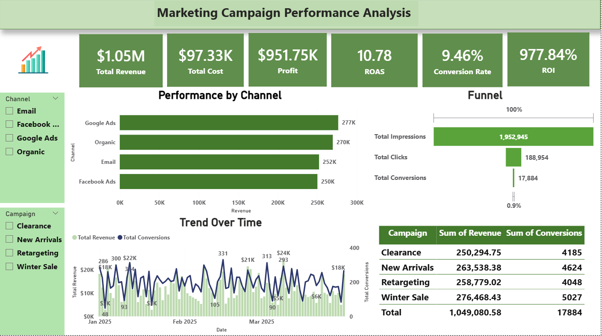

# 📊 Marketing Campaign Performance Analysis

## 📌 Overview

This project analyzes multi-channel marketing campaign performance to track key KPIs, identify trends, and support data-driven decision-making.

It reflects a sample of my work as a Marketing Analyst, applying real-world analytical approaches to evaluate campaign effectiveness and optimize marketing strategies.

---

## 📌 Note

This project is a sample representation of my work as a Marketing Analyst.
Due to data confidentiality, a publicly available dataset is used while applying the same analytical approach and business logic used in real-world projects.

---

## 🎯 Business Objective

Marketing teams need to understand:

* Which channels generate the highest revenue
* Which campaigns deliver the best performance
* Where budget is being wasted
* How to optimize marketing ROI

---

## 🛠 Tools & Technologies

* Power BI
* DAX
* Excel

---

## 📊 Key KPIs

* Total Revenue
* Total Cost
* Profit
* ROI
* ROAS
* Conversion Rate
* CTR
* CPA

---

## 📈 Dashboard Features

* KPI summary cards
* Channel performance comparison
* Marketing funnel (Impressions → Clicks → Conversions)
* Trend analysis over time
* Campaign performance table
* Interactive filters (Channel & Campaign)

---

## 🔍 Key Insights

* Google Ads is the top-performing channel in terms of revenue
* Facebook Ads drives high traffic but lower conversion efficiency
* Winter Sale campaign achieves the highest conversions
* High ROI indicates strong overall campaign profitability
* Some campaigns generate high impressions but relatively lower conversions, indicating optimization opportunities

---

## 💡 Recommendations

* Increase budget allocation to high-performing channels
* Optimize or pause low-performing campaigns
* Improve conversion strategies for high-traffic channels
* Focus on high ROI campaigns
* Continuously test and optimize campaign performance

---

## 🖼 Dashboard Preview

---

## 📁 Repository Structure

marketing-campaign-performance-analysis/
│
├── data/
│   └── marketing_campaign_dataset.csv
│
├── dashboard/
│   └── marketing_campaign_dashboard.pbix
│
├── screenshots/
│   └── dashboard.png
│
└── README.md

---

## 🚀 How to Use

1. Open the `.pbix` file using Power BI Desktop
2. Explore KPIs and visuals
3. Use filters to analyze performance

---

## 👩‍💼 About Me

Data Analyst with a background in Business Intelligence and Marketing Analytics.
I specialize in transforming data into actionable insights to support business decision-making.

🔗 LinkedIn: https://www.linkedin.com/in/afnan-madi
🔗 GitHub: https://github.com/Afnanmadi
